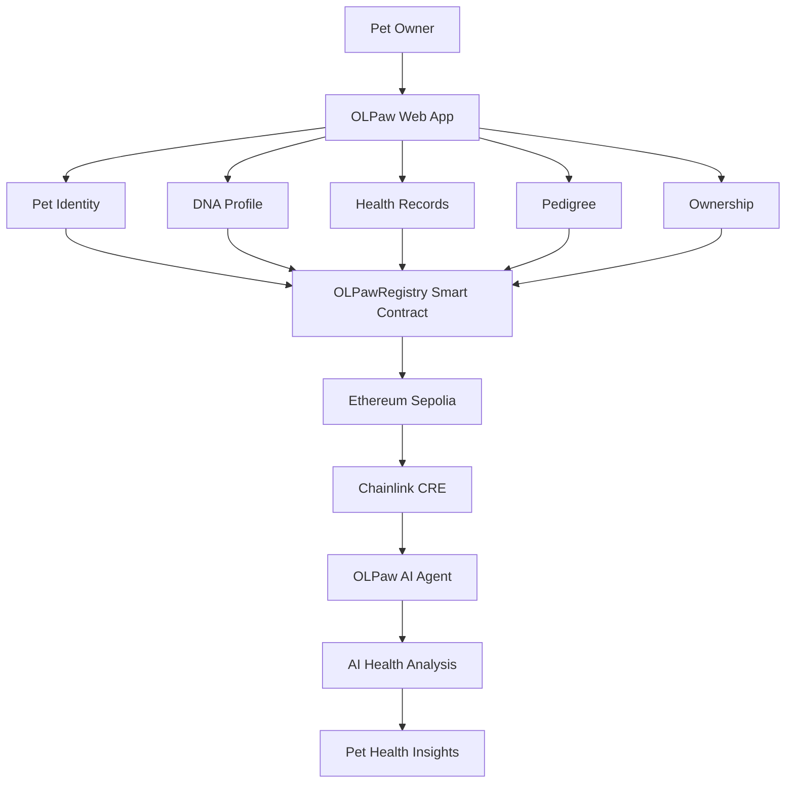

# 🐾 OLPaw — AI-Powered Pet Identity, DNA & Health Platform

> **A verifiable digital identity and health data platform for cats and dogs, powered by Web3, AI, and Chainlink CRE.**

[](https://olpaw-ai.vercel.app/)
[](https://sepolia.etherscan.io/)
[](https://sepolia.etherscan.io/)
[](https://github.com/icepack8/olpaw-ai-agent)
[](LICENSE)

---

## 🌍 What is OLPaw?

OLPaw is a **Web3-based pet identity and data platform** designed to create a trusted digital identity for cats and dogs.

Pet information is often fragmented across paper documents, clinics, breeders, owners, and different applications. OLPaw brings these records into one structured digital profile.

The platform combines:

* 🐱 Pet Identity
* 🧬 DNA Profiles
* 💉 Vaccination Records
* 🏥 Medical History
* 🌳 Pedigree & Family Tree
* 👤 Ownership Records
* 🔐 Verifiable On-chain Data
* 🤖 AI-powered Pet Health Analysis
* 🔗 Chainlink CRE for AI workflow orchestration

Our long-term vision is to build a **global, interoperable pet data infrastructure** where pet identity, DNA, ownership, and health information can be securely verified and continuously enriched.

---

# 🚀 Why OLPaw?

Today, pet information is usually scattered between:

* Owners
* Breeders
* Veterinary clinics
* Laboratories
* Pharmacies
* Paper documents
* Different pet applications

This creates several problems:

**Identity fragmentation**
A pet may have different records in different places.

**Difficult verification**
Owners and organizations cannot easily verify whether a DNA or health record belongs to the correct pet.

**Data silos**
Pet health information is difficult to connect across different services.

**Limited intelligence**
Even when information exists, owners still need to manually interpret it.

OLPaw addresses these problems by combining a **verifiable pet identity layer** with an **AI-powered health intelligence layer**.

---

# 🧬 Core Platform

Each pet can have a structured digital profile containing:

### Pet Identity

* Name
* Gender
* Date of birth
* Breed
* Physical information
* Photo
* Owner

### DNA Profile

* DNA information
* DNA hash
* DNA verification status
* Purity score

### Health Data

* Vaccination history
* Medical history
* Health reports
* Check-up information

### Family & Pedigree

* Mother
* Father
* Family tree
* Pedigree information

### Ownership

* Current owner
* Ownership history
* Transferable digital identity

---

# 🔗 Blockchain Layer

OLPaw uses blockchain to create a **verifiable data layer** for pet identity and DNA information.

The current hackathon implementation runs on:

| Parameter               | Value               |
| ----------------------- | ------------------- |
| Network                 | Ethereum Sepolia    |
| Chain ID                | 11155111            |
| Environment             | Testnet             |
| Smart Contract          | `OLPawRegistry.sol` |
| Smart Contract Language | Solidity `^0.8.24`  |
| Wallet                  | MetaMask            |

> ⚠️ **Testnet only.** This project is currently deployed for experimentation and hackathon purposes. Never use production private keys or sensitive credentials in the repository.

The smart contract is responsible for registering pet identities and storing verifiable references such as DNA/data hashes.

---

# 🤖 AI Agent — Powered by Chainlink CRE

OLPaw has been extended with an **AI-powered Pet Health Agent built using Chainlink CRE (Chainlink Runtime Environment).**

The AI Agent is designed to transform structured pet information into useful health insights.

Instead of simply storing pet data, OLPaw aims to make the data **actionable**.

### Example workflow

```text
Pet Data
   │
   ├── Identity
   ├── DNA
   ├── Vaccination
   ├── Medical History
   └── Other Health Information
          │
          ▼
   OLPaw AI Agent
          │
          ▼
   Chainlink CRE
          │
          ▼
   AI-powered Analysis
          │
          ▼
   Health Insights
   Risk Signals
   Recommendations
```

The AI Agent can serve as an intelligent layer on top of the verified pet data infrastructure.

### Potential AI capabilities

* Analyze historical health information
* Identify potential health risk patterns
* Interpret structured pet information
* Generate understandable health summaries
* Provide preventive-care suggestions
* Combine multiple pet data sources into one analysis
* Support future integration with veterinary services

> **Important:** AI-generated information is intended to support pet owners and should not replace professional veterinary diagnosis or treatment.

---

# 🔗 Why Chainlink CRE?

Chainlink CRE provides the infrastructure for building reliable workflows that connect smart contracts, external data, and computation.

For OLPaw, CRE enables the AI Agent to become part of the broader Web3 workflow rather than operating as an isolated AI chatbot.

The architecture is designed around:

```text
OLPaw Pet Data
       │
       ▼
Blockchain / Smart Contract
       │
       ▼
Chainlink CRE Workflow
       │
       ▼
AI Agent
       │
       ▼
Health Analysis
       │
       ▼
Useful Pet Health Insights
```

This creates a foundation for future integrations with:

* Veterinary clinics
* DNA laboratories
* Pharmacies
* Pet insurance
* Pet food providers
* Breeders
* Pet marketplaces
* Other Web3 applications

---

# 🧩 Architecture



---

# 📱 Application Features

## 1. Connect Wallet

Users connect their Web3 wallet through MetaMask.

No traditional password-based authentication is required for the blockchain interaction layer.

---

## 2. Register a Pet

Users can create a structured pet profile through a multi-step registration flow.

### Step 1 — Basic Information

* Name
* Date of birth
* Gender
* Photo

### Step 2 — Bio Profile

* Breed
* Color
* Characteristics
* Other pet information

### Step 3 — DNA Profile

* DNA information
* DNA hash
* DNA verification status

### Step 4 — Health Report

* Vaccinations
* Medical history
* Check-up information

### Step 5 — Owner Data

* Owner information
* Breeder / Cat Lover profile

### Step 6 — Family Tree

* Parents
* Offspring
* Pedigree information

---

# 🧬 DNA Verification

OLPaw does not need to store raw DNA information directly on-chain.

Instead, the system can use a **cryptographic hash** as a verifiable reference.

Conceptually:

```text
DNA Data
   │
   ▼
Cryptographic Hash
   │
   ▼
Blockchain
   │
   ▼
Verifiable DNA Reference
```

This allows the platform to establish data integrity while reducing the need to expose sensitive raw data on-chain.

---

# 🐾 Pet Identity

Every registered pet can have a persistent digital identity containing:

```text
Pet Identity
│
├── Basic Information
├── DNA Profile
├── Health History
├── Vaccination Records
├── Pedigree
├── Ownership
└── Verification Status
```

This creates the foundation for a future **global pet identity registry**.

---

# 🔐 Ownership

Pet ownership is represented through wallet-based identity.

Future ownership transfers can be recorded as blockchain events, creating a transparent history of changes in ownership.

This can be useful for:

* Pet adoption
* Breeding
* Pet trading
* Lost-and-found verification
* Pedigree verification
* Long-term pet identity

---

# 🏗️ Project Structure

```text
olpawAI/
│
├── contracts/
│   └── OLPawRegistry.sol
│
├── scripts/
│   └── deploy.cjs
│
├── frontend/
│   ├── src/
│   │   ├── contract.js
│   │   ├── wagmi.js
│   │   ├── App.jsx
│   │   ├── main.jsx
│   │   ├── components/
│   │   ├── pages/
│   │   └── lib/
│   │
│   ├── package.json
│   └── vite.config.js
│
├── hardhat.config.cjs
├── package.json
├── .env.example
└── README.md
```

---

# 🤖 AI Agent Repository

Because the hackathon submission allows only **one primary GitHub repository**, the main OLPaw application remains the primary project repository.

The Chainlink CRE AI Agent is maintained in a dedicated repository:

👉 **[OLPaw AI Agent — Chainlink CRE](https://github.com/icepack8/olpaw-ai-agent)**

The AI Agent repository contains the CRE workflow implementation and configuration required for the agent.

This separation keeps the main application clean while allowing the AI/CRE implementation to remain independently inspectable and reproducible.

---

# 🧪 Testnet Environment

The current hackathon version uses:

### Ethereum Sepolia

| Parameter   | Value                                              |
| ----------- | -------------------------------------------------- |
| Network     | Ethereum Sepolia                                   |
| Chain ID    | `11155111`                                         |
| RPC         | `https://ethereum-sepolia-rpc.publicnode.com`      |
| Environment | Testnet                                            |
| Explorer    | [Sepolia Etherscan](https://sepolia.etherscan.io/) |

The CRE workflow configuration also targets **Ethereum Sepolia**.

---

# ⚙️ Local Development

## Requirements

* Node.js ≥ 18
* npm ≥ 9
* Git
* MetaMask
* Sepolia ETH for testnet transactions

---

## Install

```bash
git clone https://github.com/icepack8/olpawAI.git
cd olpawAI

npm install
```

Create your environment file:

```bash
cp .env.example .env
```

Configure:

```env
PRIVATE_KEY=0x<YOUR_TESTNET_PRIVATE_KEY>
SEPOLIA_RPC=https://ethereum-sepolia-rpc.publicnode.com
```

> Never commit `.env` or private keys to GitHub.

---

# 🔨 Compile Smart Contracts

```bash
npx hardhat compile
```

---

# 🚀 Deploy to Ethereum Sepolia

```bash
npx hardhat run scripts/deploy.cjs --network sepolia
```

The deployment script automatically updates the frontend contract configuration with the deployed contract address and ABI.

---

# 💻 Run the Frontend

```bash
cd frontend
npm install
npm run dev
```

Then open:

```text
http://localhost:5173
```

Connect MetaMask using the **Ethereum Sepolia** network.

---

# 🔍 Verify Transactions

Blockchain transactions can be inspected through:

**Ethereum Sepolia Explorer**

https://sepolia.etherscan.io/

This allows judges and developers to independently verify on-chain activity.

---

# 🧪 Current Status

### MVP / Hackathon Version

The current version demonstrates the core architecture of OLPaw:

✅ Pet registration
✅ Pet identity management
✅ DNA data and verification flow
✅ Vaccination records
✅ Medical information
✅ Pedigree / family tree
✅ Ownership information
✅ Blockchain-based data verification
✅ Ethereum Sepolia deployment
✅ AI Agent integration
✅ Chainlink CRE workflow

Some ecosystem integrations are still under development, including direct connections with:

* Veterinary clinics
* Doctors
* Pharmacies
* DNA laboratories
* External pet service providers

---

# 🗺️ Future Roadmap

## Phase 1 — Current MVP

* Pet digital identity
* DNA verification
* Health records
* Ownership
* Pedigree
* Blockchain infrastructure
* AI Agent prototype

## Phase 2 — Ecosystem Integration

* Veterinary clinic integration
* DNA laboratory partnerships
* Pharmacy integration
* Verified veterinary records
* AI-assisted health monitoring

## Phase 3 — Intelligent Pet Health

* Continuous health analysis
* Personalized nutrition recommendations
* Early risk detection
* Preventive-care reminders
* AI-powered health reports

## Phase 4 — Global Pet Data Network

* International laboratory standards
* Cross-platform pet identity
* Pet insurance integration
* Breeder verification
* Marketplace integration
* Global pet data interoperability

---

# 🌎 Vision

Our vision is to create a **trusted global digital identity for every pet**.

Imagine a future where a cat or dog can have a lifelong digital profile that follows them through:

```text
Birth
  ↓
DNA
  ↓
Registration
  ↓
Vaccination
  ↓
Medical History
  ↓
Ownership
  ↓
Pedigree
  ↓
AI Health Intelligence
  ↓
Lifetime Pet Identity
```

Instead of pet data being fragmented across different organizations, OLPaw aims to create a trusted infrastructure where the pet's identity and history can remain connected throughout its lifetime.

---

# 💡 What Makes OLPaw Different?

OLPaw combines three layers:

### 1. Identity

A persistent digital identity for pets.

### 2. Verification

Blockchain-based data integrity and ownership.

### 3. Intelligence

AI-powered analysis through Chainlink CRE.

Together:

```text
IDENTITY
    +
VERIFICATION
    +
AI INTELLIGENCE
    =
TRUSTED PET DATA INFRASTRUCTURE
```

---

# 🏆 Hackathon Submission

OLPaw is submitted as the main project repository.

**Main Repository**

https://github.com/icepack8/olpawAI

**AI Agent / Chainlink CRE Repository**

https://github.com/icepack8/olpaw-ai-agent

**Live Application**

https://olpaw-ai.vercel.app/

---

# 📜 License

MIT License.

---

## 🐾 Built with

* React
* Vite
* Solidity
* Hardhat
* Ethereum Sepolia
* MetaMask
* Chainlink CRE
* AI / Agentic Workflows

**OLPaw — Giving every pet a verifiable identity and an intelligent health future. 🐾**
